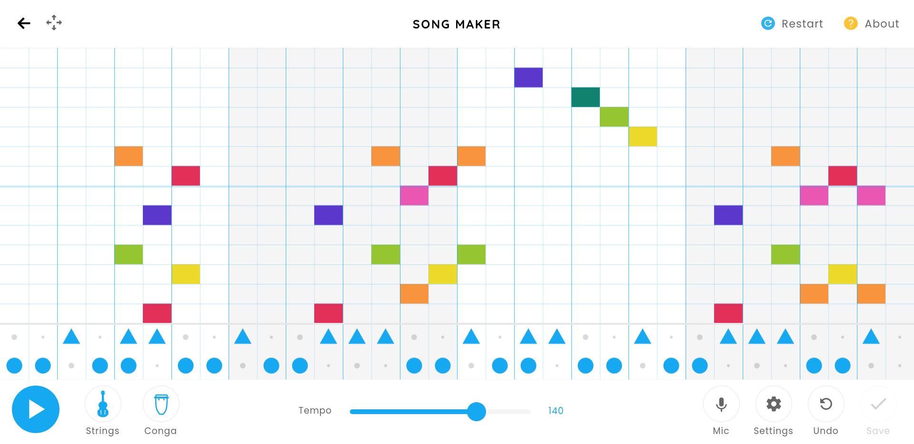

## Chrome Music Lab

[Chrome Music Lab](https://musiclab.chromeexperiments.com/Experiments) is a website with cool music experiments, like [Shared Piano](https://musiclab.chromeexperiments.com/Shared-Piano/) or [Voice Spinner](https://musiclab.chromeexperiments.com/Shared-Piano/). today i made some songs with [Song Maker](https://musiclab.chromeexperiments.com/Song-Maker/). it's really easy to use and fun too! you make a simple beat and write a melody with different instruments. check it out:

- [Song 1](https://musiclab.chromeexperiments.com/Song-Maker/song/6408441623740416)
- [Song 2](https://musiclab.chromeexperiments.com/Song-Maker/song/6643450758561792)
- [Song 3](https://musiclab.chromeexperiments.com/Song-Maker/song/6447936800817152)

